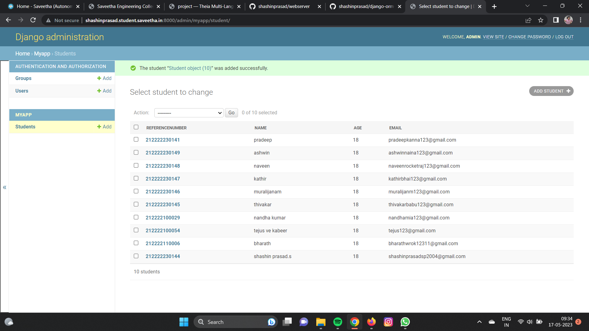
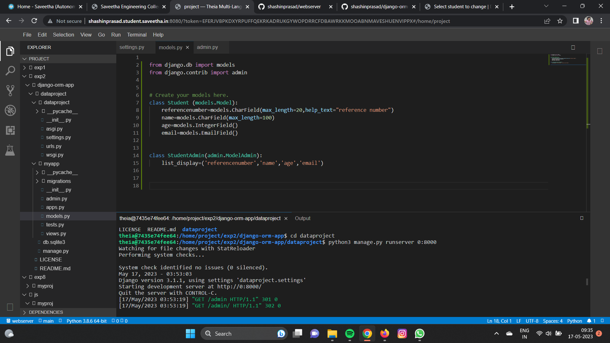

# Django ORM Web Application

## AIM
To develop a Django application to store and retrieve data from a database using Object Relational Mapping(ORM).

## Entity Relationship Diagram

Include your ER diagram here

## DESIGN STEPS

### STEP 1:
Enter the inputs

### STEP 2:
Makes your codes

### STEP 3:
End the program


## PROGRAM
```html
<!DOCTYPE html>
<html>
    <head></head>
    <body>
        <h1>
            Welcome to Saveetha Engineering College
        </h1>
    </body>
</html>

```
```python
from django.db import models
from django.contrib import admin


# Create your models here.
class Student (models.Model):
    referencenumber=models.CharField(max_length=20,help_text="reference number")
    name=models.CharField(max_length=100)
    age=models.IntegerField()
    email=models.EmailField()


class StudentAdmin(admin.ModelAdmin):
    list_display=('referencenumber','name','age','email')

```
```python
from django.contrib import admin
from .models import Student,StudentAdmin


# Register your models here.
admin.site.register(Student,StudentAdmin)

```


## OUTPUT
### clientoutput

### serveroutput



## RESULT
Thus the code has been executed successfully.